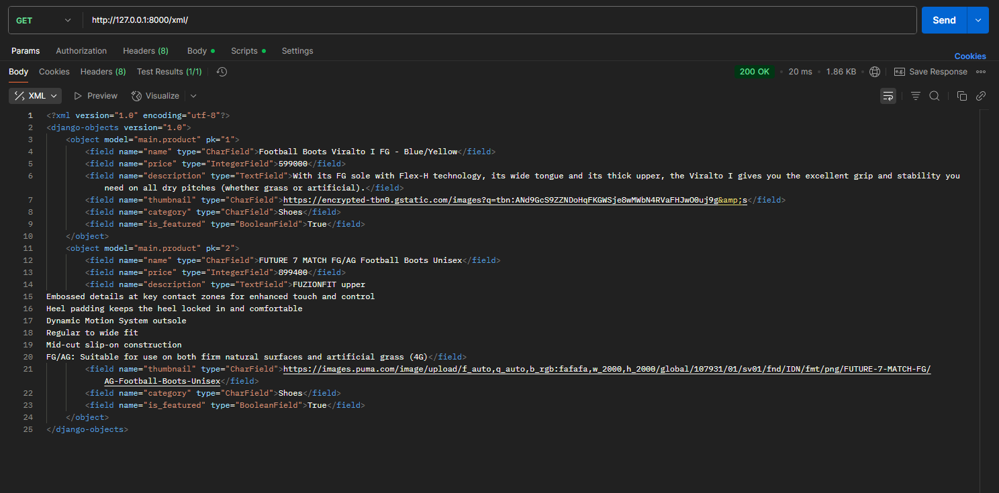
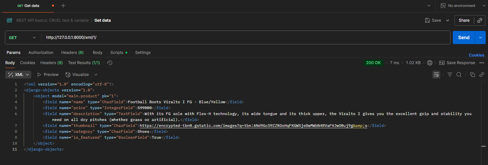
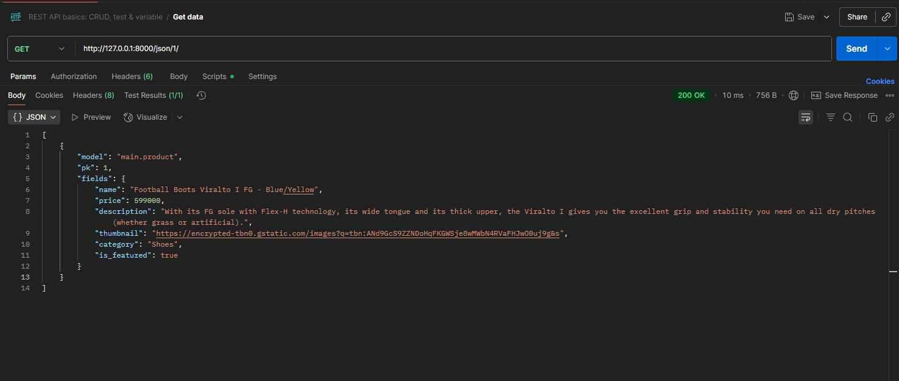

# footballshop
indivudual assaigment 2

https://muhammad-rifqi46-footballshop.pbp.cs.ui.ac.id/

Create a new Django project by running the command  django-admin startproject football_shop . this will create the base project with settings.py, urls.py, wsgi.py, and more

Create an application named main by running the python manage.py startapp main , this will create a directory named main with models.py , views.py , urls.py 
Manually create a directory named template and put a main html file

Configure routing in the project to run the main application
1.By adding main in INSTALLED APP at football_shop/settings.py
2.Add a main app url in football_shop/urls.py
3.in the main, create a urls.py file and add urls pattern 

Create a model in the main application named Product with the following mandatory attributes.
1.Create a 'Product' model in main/models.py
2.migrate it

Create a function in views.py to be returned to an HTML template that displays the application name, your name, and your class.Create a function to display info in views.py
in main views.py
from django.shortcuts import render
from .models import Product

def home(request):
    products = Product.objects.all()
    context = {
        'app_name': 'Football Shop',
        'student_name': 'Muhammad Rifqi Al Ghani',
        'student_class': 'KKI',
        'products': products,
    }
    return render(request, 'main.html', context)

7.Create the HTML template by creating main.html and then add the codes

8.Deploy it to the pws,then create an admin account to manage adding the conents of the shoes by accesing the django admin

Views.py : a bridge that connects a user request and application response
it will process a HTTP request, sends data to a template and generate a response

Urls.py : routing systems in django, locates which url goes where
it behaves as a routing table that paths to view function in views.py

In football_shop urls.py will be a first entry point of every request to the django project, it will read the urls patterns 
and if reads only '/' it will route to the application part of urls.py

In main urls.py , it will mapped the path to the view in app that is within main views.py

diagram of the relation ship of 
urls.py, views.py, models.py, and the HTML file

From medium.com

The role of settings.py is the central configuration file for a django project
it defines apps that you use in the project
sets up database django will use isn "DATABASE" segment
Controls debugging and manage the domain the app can run on

Database migrasion
1.Add classes or modify inside models.py
2.Create migration by python manage.py makemigrations
3.Apply the migrations to database python manage.py migrate (Django applies the changes to your database)

Django frame works takes cares most of the hassle of web development by having a lot of built in features and can focues more making and developing the app 

Assaigment 3
1.Data delivery is essential, it allows information exchanged beetween the server and clients. Without it  it cannot share resources and
intergrate with other systems.

2.JSON,it feels more similar to phyton code and its indentation
Its compact and easier to write and read for human

3.is_valid() is to prevent invalid data from being saved ensuring consistency
if its method retuns True. Django will know that it is safe
else it will prevoide error to the user

4.csrf_token serves as a protection a protection to csrf attacks
where it will tricks the user to submitting dangerous request via a fake web
and with csrf_token, on each form submission will carries a hidden token that gives proof that the request came from your site

implemented the checklist above step-by-step

1.Created base.html inside the templates/ folder 

2.Added button inside main.html(Add detail, Add)

3.Created the supporting templates html(add_product , product_detail)

4.Hooking it up the XML/Json views and their urls

### Postman Test Results

- **All Products (XML)**  
  

- **All Products (JSON)**  
  

- **Product by ID (XML)**  
  

- **Product by ID (JSON)**  
  

Assaigment4

1.In main/models.py import User in django and then add define a variable that define the foreign key of the user
2.Make a migration of the models
3.Create a handling of the register/logins in views.py
4.Create a html to display the register/logins in a new html file
5.Create a URL paths in main/urls.py

readme checklist
1.Django AuthenticationForm is a form that is from django to be able do a login system, it is automatically provides a field of username and password, it also checks for validation of the username and password to the database
advantage:
a built in system, so you dont need to make a authentication form manually
automatically checks the username and password to the database 
disavantage:
it is only restricted to the username and password format
not flexible enough to add another validation check (captcha , OTP)

2.authentication and authorization , Django implement of it

authentication is a process to verify your identity (by username password format)
authoriazation is how much you have control on the app it self (normal users cant access admin page)

django implementation of authentication is by using User model and authenticationform, if the login succes, then it create a session for the user
django implementation of authorization is by checking permissions,group (like @login_required) , django also provies a is_staff,is_superuser,is_authenticated to diffrentiate users permissions

3.benefits and drawbacks of using sessions and cookies in storing the state of a web application?
Session
Data stored in the server,
more secure user only will only hold sessionID
will probably need a big storage if there is going to have a lot of user 

Cookies
Data stored in the client browsers
good for storing little info such as last login session
risk for the data to be overwritten/ be stolen  if its not properly saved

4.in web development, is the usage of cookies secure by default, or is there any potential risk that we should be aware of? How does Django handle this problem?
Cookies are not inherintly safe by default
it can risk, a Cookie theft, by XSS or sniffing in the web
Cookie tampering, user can modify their cookies in the client side

how django handles it
django assaignts the cookie with a secret cookie so that i cannot be changed without properly validation
and some additional security such as
HttpOnly , where it cannot be accesed by JavaScript
CSRF token,  to prevent CSRF for forms

